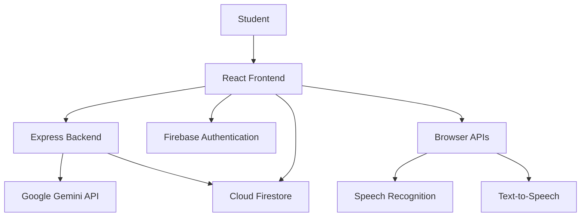
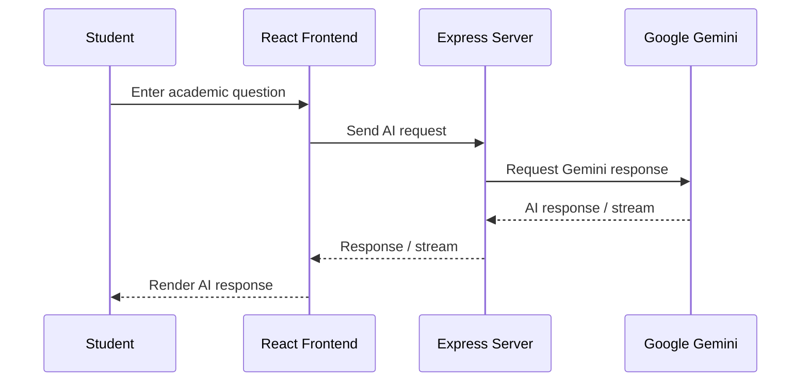

# KarpomKarpipom AI

### AI-Powered Conversational Educational Assistant for Engineering Students

KarpomKarpipom AI is an AI-powered educational assistant designed to help engineering students learn concepts, prepare for examinations, practice questions, revise important topics, and interact with an AI tutor through natural conversation.

The platform combines **Google Gemini**, **React**, **TypeScript**, **Node.js**, **Express**, and **Firebase** to provide an interactive academic learning environment.

## 🌐 Live Application

[KarpomKarpipom AI — Live Application](https://karpomkarpipom-ai.ai.studio?utm_source=chatgpt.com)

---

## 📌 Overview

KarpomKarpipom AI is designed as a specialized academic AI assistant rather than a general-purpose chatbot.

Students can use the platform to:

- Ask academic questions
- Continue conversations with contextual follow-up questions
- Learn difficult concepts step by step
- Prepare for semester examinations
- Practice multiple-choice questions
- Generate mock examinations
- Create revision notes
- Generate study cards / flashcards
- Create study sheets
- Work with academic documents
- Ask programming and engineering-related questions
- Use multiple supported languages and learning styles
- Use voice input where supported by the browser
- Save and manage previous conversations

The application supports both **authenticated users** and **guest users**.

---

# ✨ Key Features

## 🤖 AI Academic Chat

KarpomKarpipom AI provides conversational AI tutoring powered by Google Gemini.

Students can:

- Ask questions naturally
- Ask follow-up questions
- Request simpler explanations
- Request examples
- Continue multi-step discussions
- Ask programming questions
- Ask engineering and academic questions
- Request exam-oriented explanations

The chat maintains conversational context so follow-up questions can refer to previous messages.

---

## 🎓 Study Modes

The application provides specialized learning modes designed for different academic requirements.

### Standard Learning

General-purpose academic assistance for concepts, questions, examples, and explanations.

### Derivation Mode

Designed for step-by-step mathematical, engineering, and technical derivations.

### Exam Preparation

Focused on examination-oriented explanations, important points, and preparation.

### Socratic Learning

Encourages students to reason through problems rather than immediately receiving the complete answer.

### Code & Algorithms

Designed for programming concepts, algorithms, debugging, and code explanations.

### Simplify

Converts complicated concepts into easier-to-understand explanations.

---

# 📝 Learning & Practice Tools

## Practice Quiz

Students can generate practice questions based on their selected subject or topic.

The quiz experience can be used for:

- Concept revision
- Self-assessment
- Exam preparation
- Topic-wise practice

---

## 🧪 Mock Exam

The Mock Exam feature provides an examination-style practice experience.

Students can configure relevant options such as:

- Subject
- Topic
- Difficulty
- Number of questions

The generated examination can then be attempted through the application.

---

## 📚 Revision Notes

The application can generate structured revision material to help students quickly review important concepts before examinations.

Revision content can include:

- Key concepts
- Important points
- Definitions
- Explanations
- Exam-oriented information

---

## 🗂️ Study Cards / Flashcards

Students can generate study cards for quick revision.

Flashcards are useful for:

- Definitions
- Important concepts
- Terminology
- Quick recall
- Last-minute revision

---

## 📄 Study Sheet

The Study Sheet feature creates condensed academic revision material.

A study sheet can organize important information into an easy-to-review format.

---

## 📎 Document-Based Learning

The application supports academic document processing for supported document formats.

Documents can be used as a source for AI-assisted learning and question generation.

Supported document processing capabilities depend on the implementation and parser support available in the application.

---

# 🌍 Multilingual Learning

KarpomKarpipom AI is designed to support multilingual academic interaction.

Supported language styles include:

- English
- Tamil
- Tanglish
- Hindi
- Hinglish

This allows students to ask questions and receive explanations in a language style that is easier for them to understand.

---

# 🎙️ Voice Input

The application supports browser-based speech recognition where the browser provides the required Speech Recognition API.

Voice input can be used to:

1. Click the microphone button.
2. Grant microphone permission.
3. Speak the question.
4. Convert speech into text.
5. Submit the question to the AI assistant.

Browser support and microphone permissions may affect availability.

Text-based chat remains available when speech recognition is unavailable.

---

# 🔊 Text-to-Speech

AI responses can be played using browser-supported text-to-speech functionality where available.

This can be useful for:

- Listening to explanations
- Accessibility
- Hands-free learning
- Revision

---

# 🔐 Authentication

KarpomKarpipom AI uses Firebase Authentication.

Supported authentication methods include:

- Email and password
- Google authentication
- Guest mode

After successful authentication, users are directed to the application's home experience rather than automatically opening their previous conversation.

---

# 👤 Guest Mode

Users can enter the application without creating an account through Guest Mode.

Guest sessions are designed to remain separate from authenticated user data.

Guest-related information can be maintained locally according to the application's storage implementation.

Authenticated users receive persistent account-based data through Firebase.

---

# 💬 Conversation History

Authenticated users can maintain their AI conversation history.

Conversation functionality includes features such as:

- Create conversation
- Continue conversation
- Rename conversation
- Delete conversation
- Pin conversations
- View previous conversations
- Maintain message history

Previous conversations remain available through the History interface.

The application does not automatically force the user into the previous conversation after authentication.

---

# 🏗️ System Architecture

The application follows a client-server architecture.



### Main Components

**Frontend**

Responsible for:

- User interface
- Navigation
- Chat experience
- Study tools
- Authentication UI
- Streaming response rendering
- Local guest storage

**Backend**

Responsible for:

- Gemini API communication
- API key protection
- AI request processing
- Validation
- Rate limiting
- Error handling
- Server-side document processing where applicable

**Firebase**

Responsible for:

- Authentication
- User identity
- Firestore persistence
- User-specific application data

**Google Gemini**

Responsible for:

- Academic responses
- Question generation
- Quiz generation
- Mock examinations
- Revision material
- Study content

---

# 🧠 AI Request Architecture

The Gemini API key is intentionally kept on the server side.

The general request flow is:



This architecture prevents the Gemini API credential from being directly embedded into the browser application.

---

# ⚡ AI Streaming

The conversational AI system uses streaming for supported chat responses.

Instead of waiting for the complete answer before displaying anything, the server can forward generated content progressively to the frontend.

Conceptually:

```text
Student Question
       ↓
React
       ↓
Express API
       ↓
Gemini
       ↓
Streaming Response
       ↓
React
       ↓
Progressive AI Answer
```

The chat interface also supports stopping an active generation.

When generation ends, the application resets the generation state so the normal Send action becomes available again.

---

# 🛑 Generation Cancellation

AI generation supports cancellation through `AbortController` where implemented.

The generation lifecycle is designed around:

```text
Idle
  ↓
Generating
  ↓
Streaming
  ↓
Completed
```

or:

```text
Generating
  ↓
Cancelled
```

or:

```text
Generating
  ↓
Error
```

The interface should return to a usable state after successful completion, cancellation, timeout, or error.

---

# 🔥 Firebase Architecture

Firebase is used for authentication and persistent application data.

The application uses Firebase Authentication for user identity and Cloud Firestore for account-related persistence.

Conceptually:

```text
Firebase
│
├── Authentication
│   ├── Email / Password
│   └── Google OAuth
│
└── Cloud Firestore
    ├── User Data
    ├── Conversations
    ├── Messages
    └── Quiz / Learning Data
```

Authenticated data is associated with the user's Firebase UID.

---

# 🔒 Firestore Security

Firestore security rules are used to restrict access to user-specific information.

The application follows an ownership-based approach where authenticated users should only be able to access resources belonging to their own account.

The repository contains Firestore security rules that use authentication state and user ownership checks.

Security rules should always be deployed together with the application.

---

# 🛡️ Security

Security considerations implemented in the project include:

- Server-side Gemini API key handling
- Environment variable configuration
- Firebase Authentication
- Firestore security rules
- User ownership validation
- Request validation
- Payload limits
- Rate limiting
- Error sanitization
- Security-related HTTP headers
- Safe Markdown rendering
- Guest/authenticated data separation

## Important

**Never commit the Gemini API key to GitHub.**

Do not place secrets inside:

- `README.md`
- React source files
- `.tsx` files
- `.ts` files
- `.env` committed to Git
- screenshots
- GitHub issues
- public documentation

If an API key is accidentally exposed, revoke it and generate a replacement immediately.

---

# 🚦 Rate Limiting

The backend includes configurable rate-limiting controls intended to reduce abuse and excessive AI requests.

Configuration is controlled through environment variables.

Examples include limits for:

- Chat requests
- Document operations
- Quiz generation
- Summary/revision generation
- Daily user requests
- Burst requests
- IP-based requests

Exact values should be configured through environment variables rather than hardcoded into public documentation.

---

# 🧰 Technology Stack

| Layer | Technology |
|---|---|
| Frontend | React |
| Language | TypeScript |
| Build Tool | Vite |
| Backend | Node.js |
| Server Framework | Express |
| AI | Google Gemini |
| AI SDK | `@google/genai` |
| Authentication | Firebase Authentication |
| Database | Cloud Firestore |
| Styling | Tailwind CSS |
| Markdown | React Markdown |
| Code Highlighting | PrismJS |
| Document Processing | Mammoth |
| Charts | Recharts |
| Icons | Lucide React |
| Animation | Motion |
| Runtime Configuration | Environment Variables |

---

# 📦 Major Dependencies

The application uses libraries for different responsibilities, including:

```text
React
React DOM
TypeScript
Vite
Express
Firebase
@google/genai
React Markdown
Remark GFM
PrismJS
Mammoth
Recharts
Lucide React
Motion
Canvas Confetti
dotenv
```

Dependency versions should be obtained from the project's `package.json` rather than manually duplicated in this README.

---

# 📁 Project Structure

The project follows a frontend/backend separation similar to:

```text
KarpomKarpipom-AI/
│
├── src/
│   ├── components/
│   ├── pages/
│   ├── services/
│   ├── hooks/
│   ├── types/
│   └── ...
│
├── server/
│   ├── geminiService.*
│   ├── abuseProtection.*
│   └── ...
│
├── public/
│
├── firestore.rules
├── package.json
├── package-lock.json
├── vite.config.*
├── tsconfig.*
├── .env.example
├── .gitignore
└── README.md
```

The exact structure may evolve as the project develops.

---

# ⚙️ Environment Variables

Create a local `.env` file based on `.env.example`.

Typical configuration includes:

| Variable | Purpose |
|---|---|
| `GEMINI_API_KEY` | Server-side Google Gemini authentication |
| `APP_URL` | Application base URL |
| `VITE_FIREBASE_API_KEY` | Firebase web configuration |
| `VITE_FIREBASE_AUTH_DOMAIN` | Firebase authentication domain |
| `VITE_FIREBASE_PROJECT_ID` | Firebase project identifier |
| `VITE_FIREBASE_STORAGE_BUCKET` | Firebase storage configuration |
| `VITE_FIREBASE_MESSAGING_SENDER_ID` | Firebase messaging configuration |
| `VITE_FIREBASE_APP_ID` | Firebase application identifier |
| `REQUIRE_AUTH_FOR_AI` | Controls authentication requirement for AI requests |
| `RATE_LIMIT_USER_CHAT_MAX` | User chat request limit |
| `RATE_LIMIT_USER_DOC_MAX` | Document operation limit |
| `RATE_LIMIT_USER_QUIZ_MAX` | Quiz request limit |
| `RATE_LIMIT_USER_SUMMARY_MAX` | Summary/revision request limit |
| `RATE_LIMIT_DAILY_USER_MAX` | Daily user request limit |
| `RATE_LIMIT_BURST_MAX` | Burst request limit |
| `RATE_LIMIT_BURST_WINDOW_MS` | Burst window |
| `RATE_LIMIT_IP_MAX` | IP-based request limit |
| `RATE_LIMIT_WINDOW_MS` | Rate-limit window |

### Secret handling

`GEMINI_API_KEY` must remain server-side.

Never publish its value in this repository.

Firebase `VITE_*` configuration values are client-side configuration values; however, Firestore security rules and Firebase Authentication configuration must still be correctly secured.

---

# 🚀 Getting Started

## Prerequisites

Install:

- Node.js
- npm
- Git

You also need:

- A Google Gemini API credential
- A Firebase project if using Firebase functionality locally

---

## 1. Clone the Repository

```bash
git clone <YOUR_GITHUB_REPOSITORY_URL>
cd KarpomKarpipom-AI
```

---

## 2. Install Dependencies

```bash
npm install
```

---

## 3. Configure Environment Variables

Create the environment file using the project's example:

```bash
cp .env.example .env
```

On Windows, create `.env` manually if the `cp` command is unavailable.

Add the required configuration values.

Example structure:

```env
GEMINI_API_KEY=your_gemini_api_key
APP_URL=your_application_url

VITE_FIREBASE_API_KEY=your_firebase_api_key
VITE_FIREBASE_AUTH_DOMAIN=your_firebase_auth_domain
VITE_FIREBASE_PROJECT_ID=your_firebase_project_id
VITE_FIREBASE_STORAGE_BUCKET=your_firebase_storage_bucket
VITE_FIREBASE_MESSAGING_SENDER_ID=your_firebase_messaging_sender_id
VITE_FIREBASE_APP_ID=your_firebase_app_id
```

Do not copy real credentials into the README.

---

# 🔥 Firebase Setup

Create or use a Firebase project and configure the authentication and Firestore services required by the application.

## Authentication

Enable the authentication providers used by the project:

- Email/Password
- Google

The authorized domains for the deployed application must also be configured in Firebase Authentication.

## Firestore

Create a Cloud Firestore database and deploy the project's Firestore security rules.

Do not disable Firestore security rules in production.

---

# 🤖 Gemini Setup

Obtain a Gemini API credential from Google AI Studio / Google AI services.

Configure it as:

```env
GEMINI_API_KEY=your_secret_key
```

The key must be available to the server and must not be exposed through client-side JavaScript.

---

# 💻 Development

Use the development script defined in `package.json`.

Typical development command:

```bash
npm run dev
```

The application runs through the project's configured development server.

---

# 🏗️ Production Build

Build the application using the project's production build script:

```bash
npm run build
```

The production build combines the frontend assets and backend server bundle according to the repository's build configuration.

---

# ▶️ Production Start

Start the production application using the project's configured start script:

```bash
npm run start
```

The production server listens on the port configured by the deployment environment.

---

# ☁️ Deployment

The application is designed to support containerized deployment environments such as Google Cloud Run when the corresponding deployment configuration is present.

A production deployment should provide:

- Gemini API key
- Firebase configuration
- Rate-limit configuration
- Application URL
- Correct server port
- Firestore security rules
- Firebase authentication configuration

Never hardcode production secrets into source code.

---

# 🩺 Health Check

If the production server exposes the health endpoint, it can be used to verify that the backend is reachable.

```text
/api/health
```

The endpoint should be checked after deployment to confirm that the server is running correctly.

---

# 🔌 API Architecture

The Express backend provides API endpoints for AI-related operations.

The exact endpoint list should be maintained based on the current implementation.

Typical categories include:

| Category | Purpose |
|---|---|
| Chat | Conversational AI |
| Quiz | Practice question generation |
| Exam | Mock examination generation |
| Revision | Revision material generation |
| Study Sheet | Structured study content |
| Documents | Document processing |
| Health | Server health verification |

API authentication and rate limiting depend on the endpoint and current application configuration.

---

# 📊 Data Flow

## Authenticated User

```text
User
 ↓
Firebase Authentication
 ↓
Authenticated Application
 ↓
AI / Learning Tools
 ↓
Firestore
 ↓
User-specific persistence
```

## Guest User

```text
Guest
 ↓
Guest Session
 ↓
AI / Learning Tools
 ↓
Local Client Storage
```

Guest and authenticated user data should remain logically separated.

---

# 🧪 Testing & Validation

Before deployment, verify:

### Authentication

- Sign up
- Login
- Google authentication
- Logout
- Guest mode
- Authentication persistence

### AI Chat

- New conversation
- Send message
- Follow-up question
- Streaming response
- Stop generation
- Error handling
- Retry
- Conversation history

### Learning Tools

- Practice Quiz
- Mock Exam
- Revision Notes
- Study Cards
- Study Sheet
- Document-based functionality

### Voice

- Microphone permission
- Speech recognition
- Permission-denied handling
- Unsupported browser handling

### Build

Run the project's available validation/build commands.

For example:

```bash
npm run build
```

If TypeScript checking is configured separately, run the corresponding project script.

---

# ⚡ Performance Considerations

The application uses several techniques intended to improve AI interaction performance:

- Streaming responses for conversational AI
- Request cancellation
- Timeout protection
- Rate limiting
- Input validation
- Controlled conversation context
- Server-side AI communication
- Lazy service initialization where applicable

AI generation time is dependent on factors including:

- Gemini API availability
- Network latency
- Prompt size
- Input document size
- Requested output size
- API quotas and rate limits

Therefore, the application should not claim a guaranteed response time.

---

# 🛑 Error Handling

The application handles common classes of errors including:

- Invalid requests
- Authentication failures
- Authorization failures
- Rate limiting
- AI service errors
- Network failures
- Request timeouts
- Cancelled requests
- Document-processing errors

The frontend should return the user to a usable state after failed or cancelled operations rather than leaving generation controls permanently active.

---

# ♿ Accessibility

Accessibility considerations include:

- ARIA labels for important controls
- Keyboard interaction
- Dialog keyboard handling
- Accessible interactive controls
- Responsive touch targets
- Text alternatives for icon-based actions

Browser and assistive-technology behavior may vary.

---

# 📱 Responsive Design

The interface is designed for desktop and mobile screen sizes.

The responsive layout includes:

- Mobile navigation
- Responsive sidebar behavior
- Touch-friendly controls
- Responsive chat interface
- Adaptive content layout

The application should be tested across the browsers and devices relevant to the target audience.

---

# ⚠️ Limitations

KarpomKarpipom AI has several practical limitations.

### AI Accuracy

Gemini-generated educational content can contain mistakes.

Students should verify important:

- formulas
- definitions
- derivations
- programming solutions
- examination information

against authoritative academic resources.

### Voice Recognition

Speech recognition depends on browser support and microphone permissions.

### AI Availability

The application depends on external Gemini API availability, quotas, rate limits, and network connectivity.

### Guest Mode

Guest data does not provide the same persistent account-based experience as authenticated users.

### Document Processing

Document extraction quality can vary depending on document structure, formatting, size, and content.

---

# 🔧 Troubleshooting

## AI is not responding

Check:

1. `GEMINI_API_KEY`
2. Gemini API availability
3. API quota
4. Server logs
5. Network connectivity
6. Backend health endpoint

---

## Firebase Login Does Not Work

Check:

1. Firebase configuration
2. Authentication provider settings
3. Authorized domains
4. Firebase project ID
5. Browser console errors

---

## Firestore Permission Denied

Check:

1. User is authenticated
2. Firebase UID is correct
3. Firestore rules are deployed
4. Requested document belongs to the authenticated user

---

## Voice Input Does Not Work

Check:

1. Browser support
2. Microphone connection
3. Microphone permission
4. HTTPS/localhost requirements
5. Browser privacy settings

---

## AI Generation Takes Too Long

Check:

- Gemini API availability
- Request size
- Document size
- API quota
- Backend logs
- Network connection
- Server timeout configuration

The application should fail gracefully rather than leaving the interface in an indefinite loading state.

---

# 🧑‍💻 Development Guidelines

When modifying the project:

1. Keep frontend and backend responsibilities separated.
2. Never expose server-side secrets.
3. Validate external input.
4. Maintain Firestore security rules.
5. Avoid unnecessary Gemini requests.
6. Handle cancellation and timeout states.
7. Keep TypeScript types accurate.
8. Test authentication after authentication-related changes.
9. Test AI generation after Gemini-related changes.
10. Run the production build before deployment.

---

# 🤝 Contributing

Contributions are welcome.

## Development Workflow

```bash
git checkout -b feature/your-feature
```

Make your changes and test them locally.

Then:

```bash
git add .
git commit -m "Add your feature"
git push origin feature/your-feature
```

Create a Pull Request describing:

- What changed
- Why it changed
- How it was tested
- Any known limitations

---

# 🗺️ Potential Future Improvements

Potential future enhancements include:

- Automated unit and integration testing
- Expanded AI provider support
- Improved document processing
- More academic subjects and specialized tutors
- Advanced progress analytics
- Personalized learning paths
- More examination patterns
- Enhanced observability and monitoring
- Progressive Web App support
- Improved offline capabilities
- Additional accessibility improvements

These are potential future improvements and are not necessarily implemented in the current version.

---

# 🔐 Security Notice

Never commit:

```text
.env
API keys
private credentials
service-account keys
Firebase private credentials
access tokens
passwords
```

The `.gitignore` file should prevent environment and secret files from being committed.

If a secret is accidentally pushed to GitHub:

1. Revoke the credential immediately.
2. Generate a new credential.
3. Remove the secret from the repository history if necessary.
4. Check deployment environments.
5. Update the application with the new credential.

**Never assume deleting a secret from the latest commit makes it secure. Git history may still contain it.**

---

# 📄 License

A license should be added to the repository before distributing the project publicly.

If no `LICENSE` file exists, the project should not claim a specific open-source license until one is selected.

---

# 👨‍💻 Project Information

**Project:** KarpomKarpipom AI

**Category:** Generative AI / Educational Technology

**Primary Purpose:** AI-powered academic learning assistant

**AI Provider:** Google Gemini

**Frontend:** React + TypeScript

**Backend:** Node.js + Express

**Database:** Firebase Cloud Firestore

**Authentication:** Firebase Authentication

**Deployment:** AI Studio / Cloud deployment compatible architecture

---

# 🌐 Live Application

[Open KarpomKarpipom AI](https://karpomkarpipom-ai.ai.studio?utm_source=chatgpt.com)

---

## ⭐ Project Vision

KarpomKarpipom AI aims to make AI-assisted education more accessible to engineering students by combining conversational tutoring, exam preparation, practice, revision, and personalized learning tools into a single platform.

The goal is not simply to provide answers, but to help students **learn, practice, revise, and understand** academic concepts more effectively.

---

## ⚠️ Important Disclaimer

KarpomKarpipom AI is an educational assistance tool.

AI-generated responses may contain inaccurate or incomplete information. Students should independently verify critical academic, examination, mathematical, programming, and engineering information using official textbooks, university materials, documentation, or qualified instructors.

**KarpomKarpipom AI does not replace teachers, textbooks, official examination resources, or professional academic guidance.**
